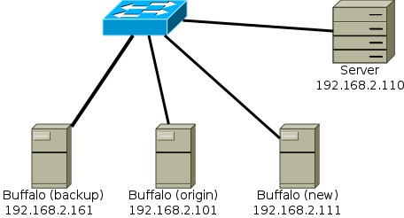

% Example Document
% Alex Hirsch
% 2017-01-01

# Headings

## Level 2 Heading

## Unnumbered Level 2 Heading {-}

### Level 3 Heading

# Pargraphs

Cras congue rutrum sodales. Sed a posuere felis, nec ornare urna. Aliquam sed
hendrerit nisl. Donec in metus nec nulla dictum mollis ut ut velit. Cras congue
rutrum sodales. Sed a posuere felis, nec ornare urna. Aliquam sed hendrerit
nisl. Donec in metus nec nulla dictum mollis ut ut velit.

Cras congue rutrum sodales. Sed a posuere felis, nec ornare urna. Aliquam sed
hendrerit nisl. Donec in metus nec nulla dictum mollis ut ut velit. Cras congue
rutrum sodales. Sed a posuere felis, nec ornare urna. Aliquam sed hendrerit
nisl. Donec in metus nec nulla dictum mollis ut ut velit. Sed a posuere felis,
nec ornare urna. Aliquam sed hendrerit nisl. Donec in metus nec nulla dictum
mollis ut ut velit.

Cras congue rutrum sodales. Sed a posuere felis, nec ornare urna. Aliquam sed
hendrerit nisl. Donec in metus nec nulla dictum mollis ut ut velit. Cras congue
rutrum sodales. Sed a posuere felis, nec ornare urna. Aliquam sed hendrerit
nisl. Donec in metus nec nulla dictum mollis ut ut velit.

# Markup

Lorem *ipsum* dolor **sit** amet, consectetur adipiscing ~~elit~~. Suspendisse
^ut^ m~agn~a tortor. `Nulla` tempus "hendrerit" efficitur. Fusce elit lorem,
sollicitudin sed consequat vitae, laoreet non nibh. Vivamus[^1] tempus,
urna[^longnote] nec vehicula^[inline footnote] sollicitudin, purus elit
facilisis turpis, et sollicitudin metus orci ac enim. Nullam consectetur mauris
nunc, ut semper justo egestas id. Pellentesque vel suscipit quam. Morbi nulla
enim --- mollis at aliquet sit amet, [tempus](http://w4rh4wk.github.io) eu
urna. Diffie--Hellman, 1--5, Some-thing-other-less-important
<http://w4rh4wk.github.io>.

[^1]: Footnote 1

[^longnote]: Footnote with longer reference

Cras congue rutrum sodales. Sed a posuere felis, nec ornare urna. Aliquam sed
hendrerit nisl. Donec in metus nec nulla dictum mollis ut ut velit. Cras congue
rutrum sodales. Sed a posuere felis, nec ornare urna. Aliquam sed hendrerit
nisl. Donec in metus nec nulla dictum mollis ut ut velit.

# References

## Cross References

Reference to [this header](#cross-references) or directly to
[Cross References].

## Quotation

> Sed in eros condimentum, consequat diam vel, lacinia mauris. Sed facilisis
> dapibus urna, et pulvinar libero iaculis sit amet. Morbi convallis lacinia
> mi, a convallis ex auctor sed.\
> --- Somebody

## Citation

Blah Blah [see @wiki:denuvo]

Blah Blah [@rfc5246]

Blah Blah [@schneier2000, pp. 33--35]

Something something as defined by @vernam1919.

# Blocks

## Pre

    # cifs origin
    //192.168.2.101/WBImmobilien  /mnt/origin/WBImmobilien  cifs   ...
    //192.168.2.101/finanzen      /mnt/origin/finanzen      cifs   ...
    //192.168.2.111/work          /mnt/new/work             cifs   ...

## Source Code

``` {.c .numberLines}
#include <stdio.h>
#include <stdlib.h>

int main(int argc, char *argv[]) {

    for (int i = 1; i < argc; i++) {
        printf("argv[%d]: %s\n", i, argv[i]);
    }

    return EXIT_SUCCESS;
}
```

## No breaks

| Line 1
| Line 2
| next Line 3
| another line 4

# Lists

## Bulelts

- List element 1
- List element 2
    - List element 2.1
    - List element 2.2
- List element 2

## Enumeration

1. List element
2. another list element
    1. list subelement 1
    2. list subelement 2
2. yet another list element

## Description

Term 1
  ~ Definition 1

Term 2
:   Definition 2

Term 3

:   Definition 3

## Examples

(@) Example 1
(@) Example 2
(@third) Example3

Here we reference (@third)

# Table

|    | *Owner* | Alice | Bob | Sara  |
| -  | -       | -     | -   | -     |
| f1 | Alice   | `x`   | -   | `r`   |
| f2 | Bob     | `r`   | `x` | `rw`  |
| f3 | Sara    | `r`   | -   | `rwx` |

# Image



This text is related to figure 1.

## TikZ


This text is related to figure 2.

# LaTeX

Some inline equation $x^2 + y^2 = z^2$ written in LaTeX.

Some display math follows:

$$f(x) = \int_{-\infty}^\infty \hat f(\xi)\,e^{2 \pi i \xi x} \,d\xi$$

Next, using raw LaTeX inside Markdown

\begin{align*}
    \text{〈1〉:} && l_2 &= f_1(r_0) \oplus l_0 \\
    \text{〈2〉:} && r_2 &= f_2(f_1(r_0) \oplus l_0) \oplus r_0 \\[-0.8em]
    \cline{1-6}
    \text{〈3〉:} && f_2(l_2) \oplus r_2 &= f_2(l_2) \oplus f_2(f_1(r_0) \oplus l_0) \oplus r_0
    && \text{〈2〉 $\oplus$ with $f_2(l_2)$} \\
    \text{〈4〉:} && f_2(f_1(r_0) \oplus l_0) \oplus r_2 &= f_2(f_1(r_0) \oplus l_0) \oplus f_2(f_1(r_0) \oplus l_0) \oplus r_0
    && \text{expand $l_2$ with 〈1〉} \\
    \text{〈5〉:} && f_2(f_1(r_0) \oplus l_0) \oplus r_2 &= r_0
    && \text{reduce right side} \\
    \text{〈6〉:} && f_1(r_0) \oplus l_2 &= f_1(r_0) \oplus f_1(r_0) \oplus l_0
    && \text{〈1〉 $\oplus$ with $f_1(r_0)$} \\
    \text{〈7〉:} && f_1(r_0) \oplus l_2 &= l_0
    && \text{reduce right side} \\
    \text{〈8〉:} && f_2(f_1(r_0) \oplus f_1(r_0) \oplus l_2) \oplus r_2 &= r_0
    && \text{〈5〉 expand $l_0$ with 〈7〉} \\
    \text{〈9〉:} && f_2(l_2) \oplus r_2 &= r_0
    && \text{reduce left side} \\[-0.8em]
    \cline{1-6}
    && f_1(f_2(l_2) \oplus r_2) \oplus l_2 &= l_0 && \text{〈7〉 expand $r_0$ with 〈9〉} \\
    && f_2(l_2) \oplus r_2 &= r_0 && \text{〈9〉}
\end{align*}

# Special

## Exec Filter

```do-exec
echo '$ uname -r'
uname -r
```

# References
